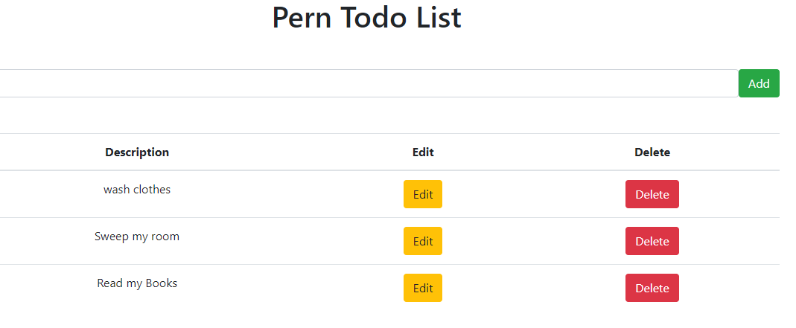

## Click to see the live app:  [Todo-List](https://marvel-pern-todo.herokuapp.com/)

## About 
A Node app built with ExpressJs React and PostgreSql. For demonstration purposes and a tutorial.

Node provides the RESTful API. Express provides the frontend and accesses the API. React stores the data.

## RestEndPoint

## FrontEnd 
Template from the Stoic Programmer 

## Usage
### Installation

1. clone the repo  `` $ git clone https://github.com/Marvel-Ib/ToDo-List.git ``

2. Change directories into the Client and Server folder Install the dependencies ``$ npm install``

3. To serve in the browser  run in both directories ``$ npm start``

## App Info

### Author
Ibironke Marvellous

